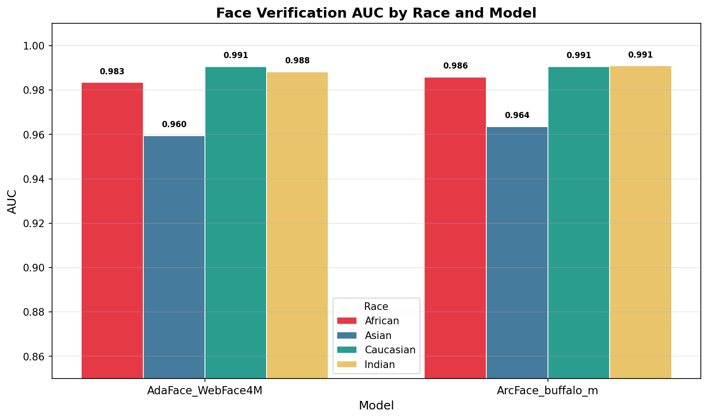
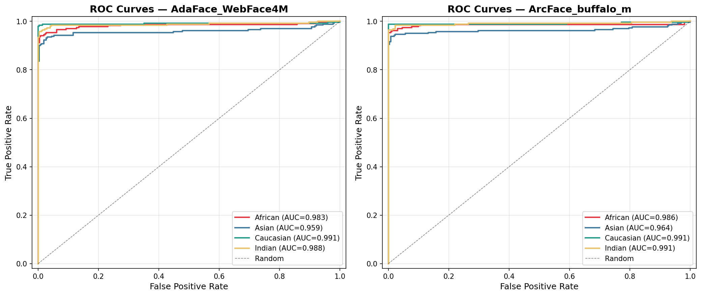

# Do VLMs Hallucinate Fairly? Auditing Racial Bias in Vision-Language Model Outputs

[](LICENSE)
[](https://www.python.org/)
[](https://huggingface.co/datasets/chidroopakanaparthy/vlm-fairness-outputs)

> **Status:** Under review — AI4GOOD Workshop @ NeurIPS 2026 / VLM4RWD Workshop @ NeurIPS 2026

---

## Abstract

Vision-Language Models (VLMs) are increasingly deployed in identity-sensitive tasks, yet their failure modes across demographic groups remain poorly understood.  We audit two open-source 7B-parameter VLMs — **LLaVA-NeXT-Mistral-7B** and **Qwen2.5-VL-7B-Instruct** — on a face-verification task derived from the Racial Faces in the Wild (RFW) benchmark.  Each model is prompted with two variants (direct feature comparison; chain-of-thought reasoning) across 240 genuine/impostor face pairs spanning African, Asian, Caucasian, and Indian ethnicities.

We decompose model outputs into atomic factual claims, annotate each claim for hallucination, and test for ethnicity-based disparity using Pearson Chi-square with Benjamini-Hochberg FDR correction.  Neither model shows statistically significant across-ethnicity disparity after FDR correction (all p\_adj > 0.15), but both exhibit marked accuracy gaps — up to **21 percentage points** between best and worst ethnic groups — driven almost entirely by high false-positive rates on impostor pairs.

---

## Repository Structure

```
VLM-fairness/
├── README.md
├── PROTOCOL.md             # Locked constants: seeds, margins, FDR grouping
├── requirements.txt
│
├── scripts/
│   ├── extract_claims.py   # Atomic claim decomposition from VLM outputs
│   ├── assign_annotators.py  # Annotator assignment (kappa subset + A/B split)
│   └── run_analysis.py     # End-to-end statistical analysis (Chi² → BH-FDR)
│
├── notebooks/
│   ├── rfw_fairness_baseline.ipynb   # Verifier setup, ROC/AUC baseline
│   ├── rfw-phase-2-run.ipynb         # Full VLM generation + analysis (canonical)
│   └── rfwtesting.ipynb              # Pilot / exploratory analysis
│
├── results/
│   ├── vlm_chi2_results_fdr.csv      # ← Primary paper results (BH-corrected)
│   ├── vlm_chi2_results.csv          # Raw Chi-square per model × variant
│   ├── vlm_summary_metrics.csv       # Per-ethnicity accuracy, TPR, FPR, TNR
│   ├── summary_metrics.csv           # High-level verifier baseline metrics
│   ├── chi2_results.csv              # Verifier baseline Chi-square
│   └── pilot/
│       ├── pilot_results.csv
│       ├── llava_next_pilot_results_annotated.csv
│       └── verification_results.csv
│
├── figures/
│   ├── auc_barplot.png               # AUC by model × ethnicity
│   └── roc_curves.png                # ROC curves
│
└── metadata/
    └── pair_assignments.csv          # Study design: pair → annotator mapping
```

---

## Key Results

### Accuracy by Ethnicity (All Prompt Variants Pooled)

| Ethnicity | LLaVA-NeXT Acc. | LLaVA-NeXT TPR | LLaVA-NeXT FPR | Qwen2.5 Acc. | Qwen2.5 TPR | Qwen2.5 FPR |
|-----------|:--------------:|:--------------:|:--------------:|:------------:|:-----------:|:-----------:|
| African   | 0.500 | 0.750 | 0.750 | 0.550 | 0.933 | 0.833 |
| Asian     | 0.504 | 0.847 | 0.833 | 0.675 | 0.933 | 0.583 |
| Caucasian | 0.467 | 0.833 | 0.900 | **0.708** | 0.867 | 0.450 |
| Indian    | **0.617** | 0.867 | 0.633 | 0.675 | 0.883 | 0.533 |

*LLaVA gap (best−worst): 15 pp. Qwen gap: 16 pp. Both driven by high impostor FPR.*

### Chi-Square Disparity Tests (BH-FDR Corrected, α = 0.05)

| Model | Slice | χ² | p (raw) | p\_adj (BH) | Significant? |
|-------|-------|----|---------|-------------|:------------:|
| LLaVA-NeXT-Mistral-7B | All variants | 6.17 | 0.104 | 0.208 | No |
| LLaVA-NeXT-Mistral-7B | V1: Direct | 1.94 | 0.585 | 0.585 | No |
| LLaVA-NeXT-Mistral-7B | V2: CoT | 4.62 | 0.202 | 0.303 | No |
| Qwen2.5-VL-7B-Instruct | All variants | 7.74 | 0.052 | 0.155 | No |
| Qwen2.5-VL-7B-Instruct | V1: Direct | 3.12 | 0.374 | 0.448 | No |
| Qwen2.5-VL-7B-Instruct | V2: CoT | **7.78** | 0.051 | 0.155 | No |

*Correction: Benjamini-Hochberg, pooled across all 6 tests. See [PROTOCOL.md](PROTOCOL.md) §5.2.*

### Figures

| AUC by Model × Ethnicity | ROC Curves |
|:------------------------:|:----------:|
|  |  |

---

## Reproducing the Analysis

### 1. Install dependencies

```bash
python -m venv .venv && source .venv/bin/activate
pip install -r requirements.txt
```

### 2. Download raw data

Raw model outputs and annotation files are too large for GitHub and are hosted on HuggingFace Datasets:

```bash
# Install huggingface_hub if needed
pip install huggingface_hub

python - <<'EOF'
from huggingface_hub import hf_hub_download
import os
os.makedirs("results_data", exist_ok=True)
for fname in ["qwen_full_results.csv", "llava_next_full_results.csv"]:
    hf_hub_download(
        repo_id="chidroopakanaparthy/vlm-fairness-outputs",
        filename=fname,
        repo_type="dataset",
        local_dir="results_data/",
    )
EOF
```

> Dataset URL: https://huggingface.co/datasets/chidroopakanaparthy/vlm-fairness-outputs *(TBD — will be live post-submission)*

### 3. Run the analysis

```bash
python scripts/run_analysis.py \
    --qwen  results_data/qwen_full_results.csv \
    --llava results_data/llava_next_full_results.csv \
    --outdir results/
```

This regenerates `results/vlm_chi2_results.csv`, `results/vlm_chi2_results_fdr.csv`, and `results/vlm_summary_metrics.csv` with zero diff against the committed files.

### 4. Claim decomposition (Phase 3)

```bash
python scripts/extract_claims.py   # outputs Phase 3/claims.csv
python scripts/assign_annotators.py  # outputs metadata/pair_assignments.csv
```

---

## Data

| File | Hosted | Description |
|------|--------|-------------|
| `qwen_full_results.csv` | HuggingFace | Qwen2.5-VL full generation outputs (480 rows) |
| `llava_next_full_results.csv` | HuggingFace | LLaVA-NeXT full generation outputs (479 rows) |
| `annotation_annotator_A/B.csv` | HuggingFace | Claim-level hallucination annotations |
| `annotation_kappa_shared.csv` | HuggingFace | Double-coded kappa subset |
| `claims.csv` | HuggingFace | All atomic claims extracted from VLM outputs |
| `pairs_locked.csv` | HuggingFace | The exact 240 pairs used (locked sampling) |

---

## Models

| Model | HuggingFace ID |
|-------|---------------|
| LLaVA-NeXT-Mistral-7B | [`llava-hf/llava-v1.6-mistral-7b-hf`](https://huggingface.co/llava-hf/llava-v1.6-mistral-7b-hf) |
| Qwen2.5-VL-7B-Instruct | [`Qwen/Qwen2.5-VL-7B-Instruct`](https://huggingface.co/Qwen/Qwen2.5-VL-7B-Instruct) |
| ArcFace (verifier) | InsightFace `buffalo_l` |
| AdaFace (verifier) | `ir_101` backbone |

---

## Citation

If you use this code or data, please cite:

```bibtex
@misc{kanaparthy2025vlmfairness,
  title        = {Do {VLMs} Hallucinate Fairly? Auditing Racial Bias in Vision-Language Model Outputs},
  author       = {Kanaparthy, Chidroopa},
  year         = {2026},
  note         = {Workshop paper, AI4GOOD @ NeurIPS 2026 / VLM4RWD @ NeurIPS 2026},
  url          = {https://github.com/Chidroopakanaparthy/VLM-fairness}
}
```

---

## License

MIT — see [LICENSE](LICENSE).  
The RFW dataset has its own terms; please see the [RFW project page](http://www.whdeng.cn/RFW/index.html).
